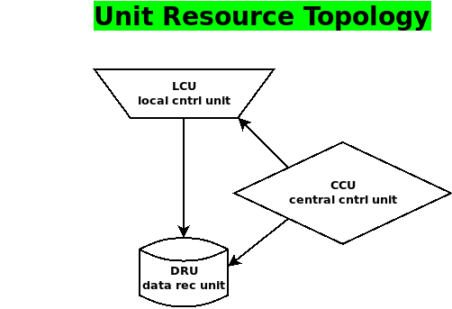
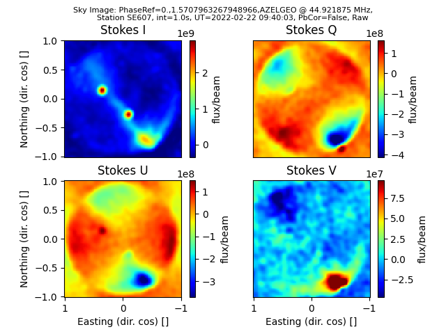

Getting Started
===============
This is a simple introduction to using ``iLiSA`` for high-level
LOFAR standalone operations and visualizations.
Here I introduce some basic concepts, some prerequist configurations,
and some one-line commands to run observations and finally how
to visualize the data you recorded.

LOFAR station resource basics
-----------------------------
``iLiSA`` is designed so that it can run one or more telescope resources
remotely. Look at the following diagram

This shows a typical layout topology consisting of a local control unit
(LCU) that performs the actual observations, a data recording unit (DRU)
where recorded data ends up and a central control unit (CCU) from which
you control and monitor the LCU and DRU. For security reasons, the LCU
will be on another network than the other resouces, and this necessitates
a gateway portal. In what follows in it assumed that this topology has
been setup already, often this will mean enabling ssh tunnels and port
configurations, so that the ``iLiSA`` user is able to ssh without password
into the LCU and DRU from the CCU.

Setting up station access
-------------------------
In order for ``iLiSA`` to work, it needs to know how to access your
local LOFAR station, i.e.,  its LCU and DRU.
This is done under your home directory, in ``~/.config/ilisa/``.
In particular the file ``access_lclstn.conf`` should contain information
on the name of the station, the user account, and the its hostname:

.. code-block:: yaml

   LCU :
     stnid : "SE607"      # Station ID
     user : "user6"       # username on LCU (all LCU processes will run as this)
     hostname : "se607c"  # internet hostname of LCU
   DRU:        # This is the machine where LCU data ends up and might process it
     hostname : localhost  # or ip address
     LOFARdataArchive : "/data/LOFAR/SE607/"    # Top path to final data archive
     BeamFormDataDir :  "/mnt/lane?/BF/SE607/"  # Path to record BFS data

This is a yaml file with sections for LCU and DRU using the Swedish SE607
LOFAR station as an example.

Basic Recording
---------------
The simplest way to use a LOFAR station is to record data using the command
line interface called ``ilisa_rec``. For let's say you want to record XST data
for Cassiopeia-A:

.. code-block:: console

   [localhost]$ ilisa_rec xst 55e6 10 Cas-A
   [localhost]$ ls /data/LOFAR/SE607/xst/
   scan_59632.40269
   [localhost]$ ls /data/LOFAR/SE607/xst/scan_59632.40269
   SCANREC_INFO.yml  SE607_20220222_093955_spw3_sb230_int1_dur30_dirCas-A_xst

Running Scan Sessions
---------------------
In practice so-called *iLiSA scan sessions* are more useful. You write an yaml
file with a list of scans that can look like this:

.. code-block:: yaml

    # Save this file as 'bst_scnses.yml'
    scans:
      - beam:
          freqspec: '52e6:148e6'
          pointing: Cas-A
        rec: [bst]
        integration:  1
        duration: 60

This is a minimal example where a beam is set up to point towards Cassiopeia-A
with a frequency range between 52-148 MHz for 60 s and the beamlets power data
is recorded. This scan session can be executed using the follow command:

.. code-block:: console

   [localhost]$ ilisa_obs -t 2022-04-26T11:15:00 bst_scnses.yml

where the last argument was the name of the yaml file shown previously
and the ``-t`` flag specifies when the scan session should start.
After the start has occured, the scan session will execute and after 60 s
the BST data will be recorded, along with metadata, on the DRU under the path
specified in the config file.

Visualizing LOFAR station data
-------------------------------
``iLiSA`` also has commands to visualize LOFAR station data.
One simply types:

.. code-block:: console

   [localhost]$ ilisa_view

In this case the latest, potentially realtime, data is plotted. Otherwise one
can type

.. code-block:: console

   [localhost]$ ilisa_view /data/LOFAR/SE607/xst/SE607_20220222_093955_spw3_sb230_int1_dur30_dirCas-A_xst

which will browse through the XST data which is shown as covariance matrices.
If one wishes to see the sky image maps, one can use the command:

.. code-block:: console

   [localhost]$ calim_image bf /data/LOFAR/SE607/xst/SE607_20220222_093955_spw3_sb230_int1_dur30_dirCas-A_xst

where ``bf`` argument implies using the beamform imaging algorithm.
The result should look something like:

There is also a nearfield ``nf`` for imaging RFI sources around the station.
