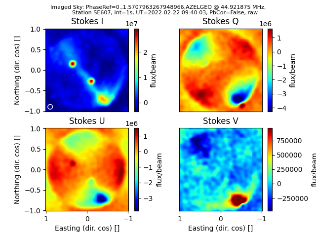

Calibration and Imaging of Radio Interferometric Data
=====================================================

The ``calim`` package deals with the calibration and imaging of radio
interferometry data. Although it is a subpackage within ``iLiSA``
it is fairly independent of LOFAR data.

The main tasks in this package is the calibration of visibility data and
the imaging of visibility data. *Calibration* is the determination of the
antenna gains and their application to measured data, while *imaging* entails
computing a brightness distribution, or map of the sky, based on measured
visibilites.

``calim`` consists of the following subpackages:

Sky Models
----------
With the ``skymodels`` module, you can create an empirically based model of the
radio sky above a geographical location for a given time and for a range of
frequencies. The models are generated using ``PyGDSM``, which are sky maps,
and from these maps, model visibilities matching a given array can be
generated. These model visibilites can then be used as a reference for the
calibration of measured visibility data (see `Calibration` Section, on how to
calibrate).

The module's CLI is run by providing it with the desired output representation
and an XST data file-folder. Output representation can be either 'vis' for
visibility data or 'img' to plot a image of the sky model corresponding to the
observational conditions of the input XST data. So for example:

.. code-block:: console

   [localhost]$ calim_model vis SE607_20220222_093955_spw3_sb230_int1_dur30_dirCas-A_xst
   [localhost]$ ls -d *mod_xst
   SE607_20220222_093955_spw3_sb230_int1_dur30_dirCas-A_mod_xst

results in a new data file-folder with presuffix ``_mod_``, signifying a model
dataset based on the dataset without this presuffix.

Calibration
-----------
The ``calibration`` module allows users to solve for and apply, gain solutions
when calibrating visibility data.

The first step of calibration is to find the gains of the antennas that best
matches the observed data with a model of the data. This is known as
solving (argument ``sol``) for the gains. E.g.

.. code-block:: console

   [localhost]$ calim_calib sol SE607_20220222_093955_spw3_sb230_int1_dur30_dirCas-A_xst
   [localhost]$ ls -d *mod_xst/*.npy
   gainsolutions.npy

Here the file-folder of the measured data is provided and the model data is
assumed to be in the corresponding '_mod_' file-folder and the resulting
gain solutions are saved in a file in the '_mod_' file-folder.

The final step in calibration is the application of the gain solutions to the
measured data to obtain calibrated data. E.g.

.. code-block:: console

   [localhost]$ calim_calib app SE607_20220222_093955_spw3_sb230_int1_dur30_dirCas-A_xst
   [localhost]$ ls -d *cal_xst/
   SE607_20220222_093955_spw3_sb230_int1_dur30_dirCas-A_cal_xst

Thus, in the application step the argument ``app`` results in a new dataset
file-folder with presuffix ``_cal_``, which is the final, calibrated
visibiilty dataset.

One can combine the two steps above such that they executed one directly after
the other by given the argument ``sol:app``.

Visibilities
------------
The ``visibilities`` module handles visibility data, that is the correlated
measurements of antenna arrays.

Imaging
-------
Imaging functionality is contained in the ``imaging`` module.

The main CLI script provided by this module is ``ilisa_image``. It has multiple
imaging algorithms which one choose to apply to visibility datasets.
It has a classic beamform imaging algorithm (argument ``bf``) and also
a near-field imager (argument ``nf``). The former makes sky images while the
latter makes images in the tangent plane of the station, which is useful for
RFI source location.

Examples
^^^^^^^^
Beamform imaging:

.. code-block:: console

   [localhost]$ calim_image bf SE607_20220222_093955_spw3_sb230_int1_dur30_dirCas-A_xst

results in an image such as:

    Polarimetric sky maps from SE607's LBA station.

which shows an example *beamformed* (argument `bf`) sky map imaged
on-the-fly from the given visibility file.
